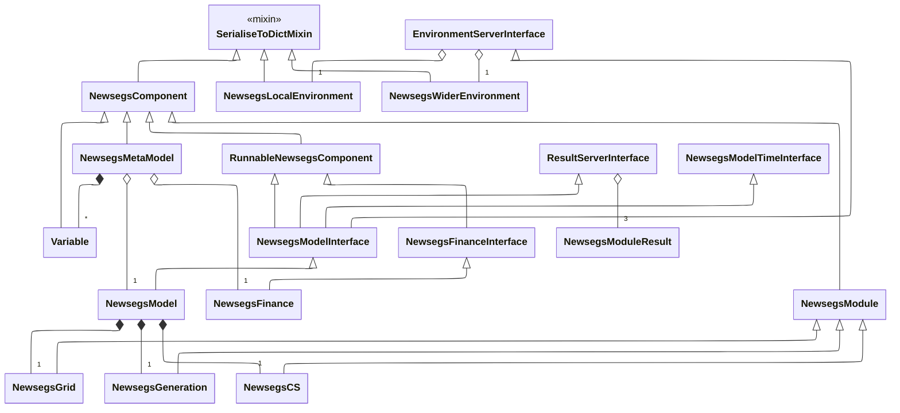

# Model ecosystem

```mermaid
---
  config:
    layout: elk
    class:
      hideEmptyMembersBox: true
---
classDiagram
    class SerialiseToDictMixin {
        <<mixin>>
    }
    NewsegsMetaModel o-- "1" NewsegsModel
    NewsegsMetaModel o-- "1" NewsegsFinance
    NewsegsMetaModel *-- "*" Variable
    NewsegsModel *-- "1" NewsegsGrid
    NewsegsModel *-- "1" NewsegsGeneration
    NewsegsModel *-- "1" NewsegsCS

    NewsegsModule <|-- NewsegsGrid
    NewsegsModule <|-- NewsegsGeneration
    NewsegsModule <|-- NewsegsCS

    NewsegsComponent <|-- NewsegsModule

    SerialiseToDictMixin <|-- NewsegsComponent
    NewsegsComponent <|-- RunnableNewsegsComponent
    
    NewsegsComponent <|-- NewsegsMetaModel
    NewsegsComponent <|-- Variable

    EnvironmentServerInterface <|-- NewsegsModelInterface
    ResultServerInterface <|-- NewsegsModelInterface
    NewsegsModelTimeInterface <|-- NewsegsModelInterface
    RunnableNewsegsComponent <|-- NewsegsModelInterface
    RunnableNewsegsComponent <|-- NewsegsFinanceInterface

    ResultServerInterface o-- "3" NewsegsModuleResult

    EnvironmentServerInterface  o-- "1" NewsegsLocalEnvironment
    EnvironmentServerInterface  o-- "1" NewsegsWiderEnvironment

    SerialiseToDictMixin <|-- NewsegsLocalEnvironment
    SerialiseToDictMixin <|-- NewsegsWiderEnvironment

    NewsegsModelInterface <|-- NewsegsModel
    NewsegsFinanceInterface <|-- NewsegsFinance
```
*NewSEGS Model ecosystem UML diagram*
